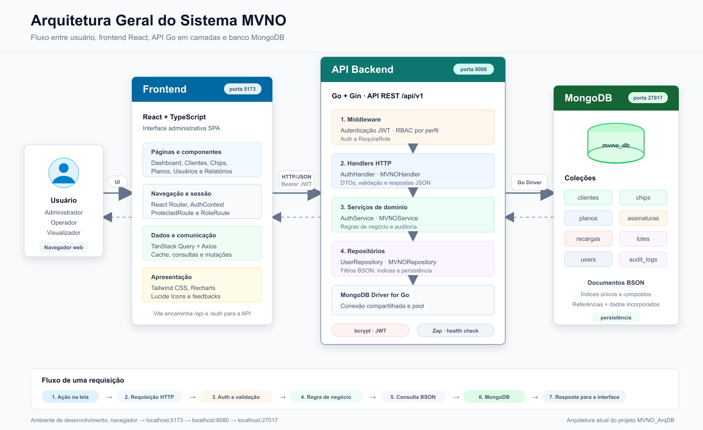

# MVNO Admin

Sistema web para administrar a operação de uma MVNO (Mobile Virtual Network Operator), com controle de clientes, chips, lotes, planos, ativações, recargas, usuários e relatórios operacionais.



## Funcionalidades

- Autenticação com JWT e perfis `admin`, `operator` e `viewer`.
- Cadastro, edição e exclusão controlada de clientes.
- Associação de um ou mais chips ao cliente.
- Cadastro individual e em lote de chips.
- Cadastro e edição de planos.
- Ativação de chips e histórico de assinaturas.
- Registro e consulta de recargas.
- Gestão, reativação e redefinição de senha de usuários.
- Dashboard, relatórios e exportação em CSV.
- Auditoria das principais operações.

## Tecnologias

**Backend:** Go 1.25, Gin, MongoDB Driver, JWT, bcrypt e Zap.

**Frontend:** React 18, TypeScript, Vite, TanStack Query, Axios, Tailwind CSS e Recharts.

**Banco de dados:** MongoDB, com as coleções `users`, `clientes`, `chips`, `planos`, `assinaturas`, `recargas`, `lotes` e `audit_logs`.

## Estrutura

```text
.
|-- frontend/          # Aplicação React
|-- internal/          # Regras, persistência, handlers e middlewares
|-- pkg/               # Utilitários compartilhados
|-- documentacao/      # Relatório e diagramas técnicos
|-- main.go            # Inicialização da API e rotas
`-- .env.example       # Configuração de exemplo
```

## Pré-requisitos

- [Go](https://go.dev/dl/) 1.25 ou superior
- [Node.js](https://nodejs.org/) 20 ou superior
- npm
- [MongoDB Community Server](https://www.mongodb.com/try/download/community)
- MongoDB Compass ou `mongosh` para visualizar o banco

## Como executar localmente

### 1. Clonar e configurar

```powershell
git clone https://github.com/Sa-Leonardo/MVNO_ArqDB.git
cd MVNO_ArqDB
Copy-Item .env.example .env
```

Configuração padrão do arquivo `.env`:

```env
APP_PORT=8080
APP_ENV=development
MONGO_URI=mongodb://localhost:27017
MONGO_DB=mvno_db
JWT_SECRET=troque-essa-chave-em-producao
JWT_EXPIRY_HOURS=24
```

### 2. Iniciar o MongoDB

Mantenha o MongoDB disponível em `mongodb://localhost:27017`. Para testar:

```powershell
mongosh "mongodb://localhost:27017"
```

### 3. Criar o primeiro administrador

Em uma instalação nova, execute uma vez no `mongosh`:

```javascript
use mvno_db

const now = new Date()

db.users.updateOne(
  { "identity.email": "admin@mvno.local" },
  {
    $setOnInsert: {
      identity: { name: "Administrador", email: "admin@mvno.local" },
      credentials: {
        password_hash: "$2a$12$BVw34zKm2zCwCY/PacASCeCdj6R7frFcKstn1dSVL11HNBbKMQAR2"
      },
      access: {
        role: "admin",
        permissions: ["users:create", "users:read", "inventory:write", "inventory:read"],
        scopes: ["mvno"]
      },
      status: { is_active: true },
      audit: { created_at: now, updated_at: now },
      metadata: { source: "seed", tags: ["user", "admin"] }
    }
  },
  { upsert: true }
)
```

Credenciais locais:

```text
E-mail: admin@mvno.local
Senha:  admin12345
```

Troque essa senha antes de utilizar outro ambiente.

### 4. Executar o backend

Na raiz do projeto:

```powershell
go mod download
go run .
```

A API estará em `http://localhost:8080`. Verifique a conexão:

```powershell
Invoke-WebRequest http://localhost:8080/health -UseBasicParsing
```

### 5. Executar o frontend

Em outro terminal:

```powershell
cd frontend
npm install
npm run dev
```

Acesse `http://localhost:5173` e entre com as credenciais locais.

## Comandos úteis

```powershell
# Testar o backend
go test ./...

# Compilar o backend
go build -o bin/mvno-api .

# Compilar o frontend
cd frontend
npm run build
```

## Primeiro fluxo de uso

1. Cadastre um plano.
2. Cadastre chips individualmente ou em lote.
3. Cadastre um cliente e selecione pelo menos um chip disponível.
4. Ative o chip vinculando cliente e plano.
5. Registre recargas e consulte os relatórios.

## Documentação técnica

- [Relatório técnico](documentacao/Relatorio_Tecnico_MVNO.docx)
- [Arquitetura geral do sistema](documentacao/diagrama_arquitetura_sistema_mvno.png)
- [Modelo documental do MongoDB](documentacao/diagrama_arquitetura_banco_mvno.png)

## Segurança

- Não envie o arquivo `.env` ao GitHub.
- Use uma chave JWT forte em ambientes publicados.
- Não reutilize as credenciais de desenvolvimento em produção.
- Restrinja o acesso direto ao MongoDB e mantenha backups.
